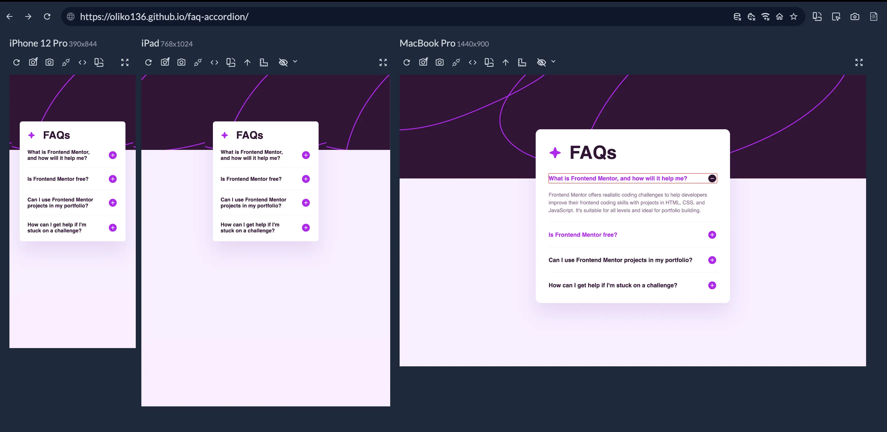

# Frontend Mentor - FAQ accordion solution

This is a solution to the [FAQ accordion challenge on Frontend Mentor](https://www.frontendmentor.io/challenges/faq-accordion-wyfFdeBwBz). Frontend Mentor challenges help you improve your coding skills by building realistic projects.

## Table of contents

- [Overview](#overview)
  - [The challenge](#the-challenge)
  - [Screenshot](#screenshot)
  - [Links](#links)
- [My process](#my-process)
  - [Built with](#built-with)
  - [What I learned](#what-i-learned)
  - [Useful resources](#useful-resources)
- [Author](#author)

## Overview

### The challenge

Users should be able to:

- Hide/Show the answer to a question when the question is clicked
- Navigate the questions and hide/show answers using keyboard navigation alone
- View the optimal layout for the interface depending on their device's screen size
- See hover and focus states for all interactive elements on the page

### Screenshot

### Links

- Solution URL: [Find challenge solution here](https://github.com/Oliko136/faq-accordion)
- Live Site URL: [Find live page here](https://oliko136.github.io/faq-accordion/)

## My process

### Built with

- Semantic HTML5 markup
- CSS custom properties
- Flexbox
- Mobile-first workflow

### What I learned

This challenge allowed me to learn how to create accordions and how to make them accessible. I also tested myself to see how I would accomplish this task without using JavaScript - I used buttons and their focus functionality for this.

### Useful resources

- [W3C Accordion Pattern Accessibility Guide](https://www.w3.org/WAI/ARIA/apg/patterns/accordion/) - This is an amazing article on the basic accessibility patterns and demands of an accordion component. It helped me understand how to properly use ARIA to increase accessibility of this pattern.

## Author

- LinkedIn - [@olha-sliusarenko](https://www.linkedin.com/in/olha-sliusarenko/)
- X - [@committedto_git](https://x.com/committedto_git)
- Instagram - [@committedto_git](https://www.instagram.com/committedto_git/)
- Frontend Mentor - [@Oliko136](https://www.frontendmentor.io/profile/Oliko136)
